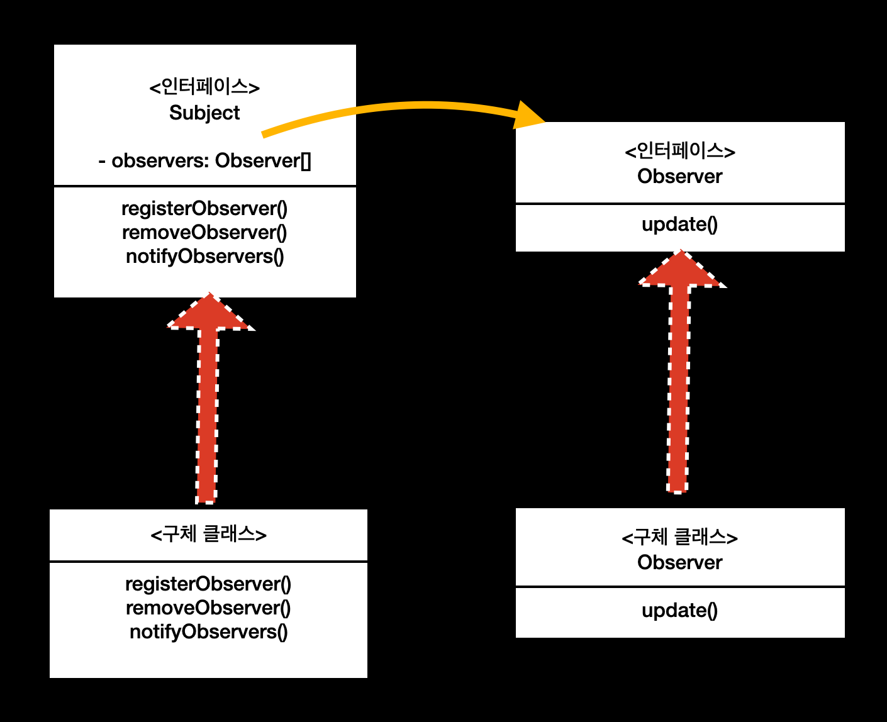

## chap 1. 디자인 패턴 소개와 전략 패턴
- 디자인 원칙: 애플리케이션에서 달라지는 부분을 찾아내고, 달라지지 않는 부분과 분리한다. 
즉 **달라지는 부분을 찾아서 나머지 코드에 영향을 주지 않도록 캡슐화**하면 코드를 변경하는
과정에서 의도치 않게 발생하는 일을 줄이면서 시스템의 유연성을 향상시킬 수 있다

ex)
아래 네 종류의 오리가 있다고 가정할 경우
- 날지 않으며 꽦괙 소리를 내는 오리(A)
- 날지 않으며 삑삑 소리를 내는 오리(B)
- 날며 꽦괙 소리를 내는 오리(C)
- 날며 삑삑 소리를 내는 오리(D)

이를 상속을 이용하여 오리를 구현할 경우 아래와 같이 서로 다른 날갯짓과 소리를 내는 4개의 오리 클래스를 생성하는 방법을 생각할 수 있다.
```kotlin
abstract class InheritDuck {
    fun swim() {
        println("swin")
    }
    abstract fun display()

    abstract fun performFly()

    abstract fun performQuack()
}
// 날지 않으며 꽦괙 소리를 내는 오리(A)
class NoFlyAndQuckDuck() : InheritDuck() {
    override fun display() {
        println("display")
    }
    
    override fun performFly() {
        println("날고 이쒀")
    }

    override fun performQuack() {
        println("꽥꽥")
    }
}

// 날지 않으며 삑삑 소리를 내는 오리(B)
class FlyAndBeepDuck: InheritDuck() {
    override fun display() {
        println("display")
    }

    override fun performFly() {
        println("못 날고 이쒀")
    }

    override fun performQuack() {
        println("꽥꽥")
    }
}
```
그러나 위와 같이 진행할 경우, 날지 못하고 새로운 소리('쓱쓱')를 내는 오리 클래스를 정의해야 할 때 `못 날고 있다`는 것을 표현한 performFly 메서드의 내용은 중복되고
각 오리 클래스의 나는 행동 등을 동적으로 실행 시 바끌 수 없다는 단점이 있다. 

이 경우 상속 대신 구성을 사용하여 구현하는 방법을 생각해 볼 수 있다.

- 구성을 이용한 경우 
  - 나는 행동과 관련된 FlyBehavior 인터페이스와 소리를 내는 행동과 관련된 QuackBehavior 인터페이스를 정의한 후,
오리 클래스에서 두 인터페이스를 변수 타입으로 갖고 있으면, 추후 '쓱쓱' 소리를 내는 오리가 나타날 경우 해당 소리를 내는 QuackBehavior를 구현한 클래스를 추가하여 사용할 수 있다.
따라서 하나의 오리 클래스를 사용하여 변수에 선언된 인터페이스 구현체를 변경함으로써 동적으로 실행 시 행동을 바꿀 수 있게 된다.
```kotlin
// 나는 행동과 관련된 인터페이스 정의
interface FlyBehavior {
    fun fly()
}

class FlyNoWay: FlyBehavior {
    override fun fly() {
        println("못 날고 이쒀")
    }
}

class FlyWithWings: FlyBehavior {
    override fun fly() {
        println("날고 이쒀")
    }
}

// 소리 내는 행동과 관련된 인터페이스 정의
interface QuackBehavior {
    fun quack()
}

class QuackQuack : QuackBehavior {
    override fun quack() {
        println("꽥꽥")
    }
}


class BeepQuack : QuackBehavior {
    override fun quack() {
        println("삑삑")
    }
}

class MuteQuack : QuackBehavior {
    override fun quack() {
        println("조용")
    }
}
```

```kotlin
abstract class Duck {
    protected lateinit var flyBehavior: FlyBehavior
    protected lateinit var quackBehavior: QuackBehavior

    abstract fun display()

    fun performFly() {
        flyBehavior.fly()
    }

    fun performQuack() {
        quackBehavior.quack()
    }
    
    fun performQuack(quackBehavior: QuackBehavior) {
        quackBehavior.quack()
    }

    // set 을 통해 구현체 변경 가능
    fun updateQuackBehavior(quackBehavior: QuackBehavior) {
        this.quackBehavior = quackBehavior
    }
}
```

```kotlin
class SampleDuck(): Duck() {
    constructor(flyBehaviorValue: FlyBehavior, quackBehaviorValue: QuackBehavior) : this() {
        this.flyBehavior = flyBehaviorValue
        this.quackBehavior = quackBehaviorValue
    }

    override fun display() {
        println("display")
    }
}

fun main() {
    val secondDuck = SampleDuck(flyBehaviorValue = FlyNoWay(), quackBehaviorValue = MuteQuack())
    secondDuck.display() // display2
    secondDuck.performQuack() // 조용
    secondDuck.performFly() // 못 날고 이쒀

    // 나는 행동 인터페이스 변경
    secondDuck.updateQuackBehavior(BeepQuack())
    secondDuck.performQuack() // 삑삑
}
```
현재 오리 클래스에는 FlyBehavior, QuackBehavior 인터페이스가 있으며 각 인터페이스의 구현체를 통해 나는 행동과 소리를 내는 행동을 위임 받는다.
오리 클래스는 각 인터페이스를 구현한 구체적인 클래스에 대해 살필 필요가 없이, 각 인터페이스를 상속한 객체들을 사용하는 방식으로 구성(composition)을 이용한다.
즉 인터페이스를 사용함으로써 오리 클래스가 특정 행동을 구현한 구체 클래스에 의존하지 않고, 상위 형식에 맞춰 프로그래밍을 하므로 실행 시에 구현체를 동적을 변경할 수 있다.
> 상속보다 구성을 활용하면 구성요소를 사용하는 객체에선 올바른 행동 인터페이스를 구현하기만 하면 실행 시에 행동을 바꿀 수도 있다.

## chap2. 객체들에게 연락 돌리기 (옵저버 패턴)
옵저버 패턴의 예로 신문사 + 구독자를 생각할 수 있다.
독자가 신문사를 구독하게 되면, 독자는 구독을 해지하기 전까지 신문을 계속 받을 수 있다.
즉 신문사라는 주제(subject)를 observer 인 구독자가 구독(subscribe)하고 있다.

- 주제(A)에선 중요한 데이터를 관리한다.
- B 객체가 주제(A)를 구독하고 싶을 경우, 본인을 A 주제에 대한 옵저버 집합에 등록한다.  
- A 주제 데이터가 바뀌면 A를 구독하고 있는 옵저버들(B 포함)에게 해당 소식과 새 데이터가 전해진다.
  - A 주제의 옵저버는 A 주제를 구독하고 있으며, A 주제의 데이터가 바뀌면 갱신 데이터 내용을 전달받는다.
- B 객체가 A 구독을 해지할 경우, 본인을 A 주제에 대한 옵저버 집합에서 제거한다.

> 옵저버 패턴은 한 객체의 상태가 바뀌면, 그 객체에 의존하는 다른 객체들에게 연락이 가고
자동으로 내용이 갱신되는 방식으로 일대다 의존성을 말한다

옵저버 패턴에서는 주제(subject)가 객체의 상태를 저장하고 제어한다.
옵저버는 상태를 사용하지만 소유할 필요가 없으니 주제(subject)에 의존적인 성질을 갖게 된다.
그러므로 주제와 옵저버가 일대다 의존성을 갖게 된다.

### 옵저버 패턴의 구조


신규 옵저버가 생길 경우 옵저버 인터페이스를 구현하여 새로운 옵저버를 추가를 할 수 있어, 주제와 옵저버는 **느슨하게 결합**되어 있다.

느슨하게 결합하는 디자인을 사용하면 변경사항이 생겨도 무난히 처리할 수 있는 유연한 객체지향 시스템을 구축할 수 있다.
즉 주제는 옵저버가 특정 인터페이스를 구현한다는 사실만 알고, 옵저버의 구체 클레스가 무엇인지와 옵저버에서 무슨 일을 하는지 알 필요가 없게 된다.

#### 옵저버를 사용한 예제 상황
기상 스테이션으로부터 온도, 습도, 기압이 변경될 때마다 각각의 3개 화면에 정보들을 다르게 조합한 정보를 보여줘야 하는 경우,
옵저버 패턴을 이용해서 구현할 수 있다.
각각의 화면이 기상 스테이션의 정보를 구독하여, 기상 스테이션이 보유한 기상 정보가 업데이트될 경우 옵저버인 화면이 담고 있는 기상 정보 또한 함께 변경되도록 하는 예제 코드는 아래와 같다. 

```kotlin
// 주제 인터페이스
interface Subject {
  // 옵저버를 담고 있는 리스트
  val observers: MutableList<Observer>

  // 옵저버 집합에 신규 옵저버 등록 (구독 신청)
  fun registerObserver(observer: Observer) {
    observers.add(observer)
  }
  // 옵저버 집합에서 옵저버 제거 (구독 해제)
  fun removeObserver(observer: Observer) {
    observers.remove(observer)
  }
  // 옵저버 집합에 존재하는 옵저버들에게 정보가 변경되었다는 사실을 알림
  fun notifyObservers()
}

interface Observer {
  // 구독한 정보가 변경될 경우, 호출되는 메서드
  fun update(tmp: Float, humidity: Float, pressure: Float)
}

// 온도, 습도, 기압 등의 기상 정보 주제를 저장하는 객체
class WeatherData : Subject {
  override val observers: MutableList<Observer> = mutableListOf()
  private var temperature: Float = 0F
  private var humidity: Float = 0F
  private var pressure: Float = 0F

  override fun notifyObservers() {
    observers.forEach {
      it.update(temperature, humidity, pressure)
    }
  }
  
  // 기상 정보가 변경된 경우, 기상 정보를 변경한 후 옵저버들에게 이를 알림
  fun measurementsChanged(tmp: Float, humidity: Float, pressure: Float) {
    this.temperature = tmp
    this.humidity = humidity
    this.pressure = pressure
    notifyObservers()
  }
}
```
```kotlin
// 화면 디스플레이 관련 인터페이스 
interface DisplayElement {
  fun display()
}

// 온도, 습도, 기압 등의 기상 정보 주제를 구독하는 옵저버 1
class CurrentConditionsDisplay(private val weatherData: WeatherData) : Observer, DisplayElement {
  private var temperature: Float = 0F
  private var humidity: Float = 0F

  init {
    // 기상 정보 주제에 본인을 옵저버로 등록
    weatherData.registerObserver(this)
  }

  // 주제로 부터 정보가 바뀌었다는 알림을 받을 경우 display 메서드를 호출해 변경된 정보를 출력함
  override fun update(tmp: Float, humidity: Float, pressure: Float) {
    this.temperature = tmp
    this.humidity = humidity
    display()
  }

  override fun display() {
    println("햔재 상태: 온도 = $temperature F, 습도: $humidity %")
  }
}

// 온도, 습도, 기압 등의 기상 정보 주제를 구독하는 옵저버 2
class CurrentPressureDisplay(private val weatherData: WeatherData) : Observer, DisplayElement {
  private var pressure: Float = 0F

  init {
    weatherData.registerObserver(this)
  }

  override fun update(tmp: Float, humidity: Float, pressure: Float) {
    this.pressure = pressure
    display()
  }

  override fun display() {
    println("햔재 기압: $pressure")
  }
}

fun main() {
  val weatherData = WeatherData()
  val conditionsDisplay = CurrentConditionsDisplay(weatherData)
  val pressureDisplay = CurrentPressureDisplay(weatherData)

  // 기상 정보를 구독하고 있는 2개의 디스플레이에서 정보 변경된 것이 출력된다
  // 햔재 상태: 온도 = 80.0 F, 습도: 65.0 %
  // 햔재 기압: 30.4
  weatherData.measurementsChanged(80f, 65f, 30.4f)

  // pressureDisplay 가 기상 정보 구독을 해제함
  weatherData.removeObserver(pressureDisplay)
  // 기상 정보를 구독하고 있는 1개의 디스플레이에서만(conditionsDisplay) 정보 변경된 것이 출력된다
  // 햔재 상태: 온도 = 20.0 F, 습도: 65.0 %
  weatherData.measurementsChanged(20f, 65f, 30.4f)
}

```
위 방식은 주제가 옵저버에게 **주제와 함께 정보를 보내는 푸시 방식**으로 알림을 보내고 있다.
즉 아래와 같이 주제가 변경될 때, 변경된 모든 정보(기온, 습도, 기압)을 옵저버에게 바로 보내고 있다.
```
it.update(temperature, humidity, pressure)
```
푸시 방식의 경우, 모든 정보를 함께 보내므로 CurrentPressureDisplay 객체의 경우 필요하지 않은 기온, 습도 정보도 함께 받게 된다. 

따라서 푸시 방식이 아닌, 옵저버에서는 정보가 변경되었다는 알림만 받고 
알림을 받은 옵저버가 주제로 부터 상태를 끌어오는 풀 방식으로도 구현할 수 있다.
즉 옵저버가 변경되었다는 이벤트를 받을 경우, 필요한 정보를 기상 스테이션에 요청해서 받아오는 방식이다.
```kotlin
interface Subject {
    val observers: MutableList<Observer>

    fun registerObserver(o: Observer) {
        observers.add(o)
    }

    fun removeObserver(o: Observer) {
        observers.remove(o)
    }
    
    fun notifyObservers() {
        observers.forEach {
            it.update()
        }
    }
}

interface Observer {
   // 옵저버는 정보가 변경되었다는 알림만 받게 된다.
    fun update()
}

class WeatherData : Subject {
    override val observers: MutableList<Observer> = mutableListOf()

    var temperature: Float = 0F
    var humidity: Float = 0F
    var pressure: Float = 0F

    fun measurementsChanged(tmp: Float, humidity: Float, pressure: Float) {
        this.temperature = tmp
        this.humidity = humidity
        this.pressure = pressure
        notifyObservers()
    }
}
```

```kotlin
interface DisplayElement {
    fun display()
}

class CurrentConditionsDisplay(private val weatherData: WeatherData) : Observer, DisplayElement {
    private var temperature: Float = 0F
    private var humidity: Float = 0F

    init {
        weatherData.registerObserver(this)
    }
  
    override fun update() {
        // 기상 정보가 업데이트 된 경우, 직접 필요한 정보(기온, 습도)만 받아온다 (pull 방식)  
        this.temperature = weatherData.temperature
        this.humidity = weatherData.humidity
        display()
    }

    override fun display() {
        println("햔재 상태: 온도 = $temperature F, 습도: $humidity %")
    }
}

class CurrentPressureDisplay(private val weatherData: WeatherData) : Observer, DisplayElement {
    private var pressure: Float = 0F

    init {
        weatherData.registerObserver(this)
    }

    override fun update() {
        this.pressure = weatherData.pressure
        display()
    }

    override fun display() {
        println("햔재 기압: $pressure")
    }
}

fun main() {
  val weatherData = WeatherData()
  val conditionsDisplay = CurrentConditionsDisplay(weatherData)
  val pressureDisplay = CurrentPressureDisplay(weatherData)

  // 기상 정보를 구독하고 있는 2개의 디스플레이에서 정보 변경된 것이 출력된다
  // 햔재 상태: 온도 = 80.0 F, 습도: 65.0 %
  // 햔재 기압: 30.4
  weatherData.measurementsChanged(80f, 65f, 30.4f)

  // 기상 정보를 구독하고 있는 1개의 디스플레이에서만(pressureDisplay) 정보 변경된 것이 출력된다
  weatherData.removeObserver(conditionsDisplay)
  weatherData.measurementsChanged(20f, 65f, 30.4f)
  // 햔재 기압: 30.4
}
```
### 3장 데코레이터 패턴
> 데코레이터(장식) 패턴 
: 객체에 추가 요소를 동적으로 더하는 패턴으로, 이를 사용하면 서브 클래스를 만들 때보다 훨씬 유연하게 기능을
> 확장할 수 있다.

데코레이터 패턴은 **추상 구성 요소**와 이를 구현한 **구상 구성 요소들**, 
**추상 데코레이터**와 이를 구현한 **데코레이터들**로 구현된다. 

이때의 추상 구성 요소는 인터페이스(interface) 혹은 추상 클래스(abstract)로 선언할 수 있다. 
- **추상 구성 요소**는 데코레이터(wrappers), 구상 구성 요소(wrapped objects)에 필요한 인터페이스를 정의한다.
- **추상 구성 요소를 구현한 구상 구성 요소**는 추후 데코레이터에 의해 변할 수 있는 기본 행동 등을 정의한다.
- **추상 데코레이터**는 데코레이터로 감싸는 객체의 형식(추상 구성 요소)과 같다. 
추상 데코레이터 내부엔 구성 요소(wrapped object)를 가리키는 필드가 있다.
해당 필드에는 구상 구성 요소뿐만 아니라, 데코레이터도 담길 수 있으므로 타입은 추상 구성 요소 타입과 동일해야만 한다.
- **추상 데코레이터를 구현한 데코레이터**는 구성 요소에 행동을 동적으로 추가한다. 즉 추상 데코레이터에 있는 메서드를 오버라이딩하여,
재정의하거나 부모 메서드 호출 전이나 후에 필요한 동작을 실행한다.

예로 java.io 패키지에서 **추상 구성 요소로 InputStream** 이 있고 InputStream 를 구현한 FileInputStream,
ByteArrayInputStream 등이 있다. 이들은 데코레이터에 의해 감싸이는 구상 구성 요소이다.

**FilterInputStream 은 InputStream 를 상속한 추상 데코레이터**로, 부가적인 기능을 제공할 때 사용되는 클래스이며 내부 변수로
InputStream 값을 담고 있다. 
FilterInputStream 를 구현한 데코레이터로는 BufferedInputStream 이 있다. 
BufferedInputStream 은 입력을 버퍼링 하는 등의 기능을 제공한다.

데코레이터 패턴은 기존 코드를 건드리지 않고 새 기능(변경)을 추가할 수 있게 도와준다. 즉 OCP 를 준수한다.

**- OCP (Open Closed principle)**
  - **클래스는 확장에는 열려 있어야 하지만 변경에는 닫혀 있어야 한다**
  - 가장 바뀔 가능성이 높은 부분을 중점적으로 살펴보고 OCP 를 필요에 따라 적용하는 방법을 추천한다.
    무조건 OCP 를 적용하다 보면 시스템이 필요 이상으로 복잡해질 수 있으므로 주의해야 한다.
  
**- 데코레이터 패턴 사용 시 주의할 점** 
  - 자잘한 클래스가 많이 추가되는 경우, 남들이 이해하기 어렵거나 코드가 필요 이상으로 복잡해질 수 있다
  - 구성요소를 사용하는 클라이언트는 특정 데코레이터의 존재를 알 수 없어야 한다. 클라이언트가 구체적인 형식을 가진 특정 구성 요소에 의존하는 것을 주의해야 한다.


---
- **Reference**
  - 헤드 퍼스트 디자인 패턴 도서
  - https://refactoring.guru
